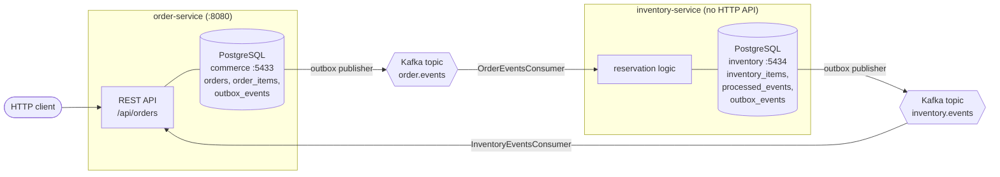

# Architecture

This document describes the system **as it exists in this repository today**.
Anything not yet built is listed separately under
[Implemented vs. planned](#implemented-vs-planned).

## Overview

The platform is a set of independently deployable Spring Boot services that
communicate asynchronously over Apache Kafka. There are currently **two**
services, each owning its own PostgreSQL database. Services never call each
other synchronously and never share a database; the only integration point is
Kafka.



Both directions of the loop use the same mechanism: a business transaction
writes domain state **and** an outbox row in one database transaction, and a
scheduled publisher later ships unpublished outbox rows to Kafka. See
[EVENT_FLOW.md](EVENT_FLOW.md) for the message contracts and the outbox
mechanics.

## Runtime components

| Component | Image / module | Local endpoint | Notes |
|---|---|---|---|
| order-service | `services/order-service` | `http://localhost:8080` | Spring MVC REST API + Actuator (`health`, `info`) |
| inventory-service | `services/inventory-service` | none | No web or actuator dependency; runs as a Kafka consumer/publisher process |
| PostgreSQL (orders) | `postgres:17-alpine` | `localhost:5433` | Compose service `postgres`, database from `POSTGRES_DB` |
| PostgreSQL (inventory) | `postgres:17-alpine` | `localhost:5434` | Compose service `inventory-postgres`, database `inventory` |
| Kafka | `apache/kafka:4.0.0` | `localhost:29092` | Compose service `kafka`, single-node KRaft (broker + controller), default 3 partitions |

Both services are built on the Spring Boot `4.1.1` parent with
`<java.version>21</java.version>`, use Flyway for schema migrations, and run
with `spring.jpa.hibernate.ddl-auto=validate` — the JPA mappings are validated
against the Flyway-managed schema at startup, never generated from it.

## order-service responsibilities

Source: `services/order-service/src/main/java/com/ahmetkeles/orderservice`

1. **Own the order aggregate.** `Order` and `OrderItem` (`domain/`) enforce the
   invariants: a customer id and a non-blank currency are required, item
   quantity must be positive, unit price must be non-negative, `totalAmount` is
   recomputed from item subtotals, and a new order starts as `PENDING`.
2. **Expose the public REST API** (`api/OrderController`):

   | Method | Path | Behavior |
   |---|---|---|
   | `POST` | `/api/orders` | Creates a `PENDING` order from `{customerId, currency}`, returns `201` |
   | `GET` | `/api/orders/{orderId}` | Returns the order with its items |
   | `POST` | `/api/orders/{orderId}/items` | Adds `{productId, quantity, unitPrice}` and returns the updated order |

   `RestExceptionHandler` maps `OrderNotFoundException` to `404 not_found`,
   bean-validation and path-type failures to `400 validation_error`, and
   `IllegalArgumentException` to `400 invalid_argument`, all as
   `ApiError {status, error, message}`.
3. **Write outbox events in the same transaction as the state change.**
   `OrderService.createOrder` writes the order plus an `ORDER_CREATED` outbox
   row; `OrderService.addItem` writes the item plus an `ORDER_ITEM_ADDED` row.
4. **Publish the outbox to Kafka.** `OutboxPublisher` polls unpublished rows and
   sends them to `order.events`.
5. **React to inventory events.** `InventoryEventsConsumer` listens to
   `inventory.events`, and on `INVENTORY_RESERVED` calls
   `OrderService.confirmOrder`, moving the order `PENDING → CONFIRMED`.
6. **Expose health.** `management.endpoints.web.exposure.include=health,info`.

### order-service schema

`V1__create_order_schema.sql` creates `orders` (with a
`CHECK (status IN ('PENDING','CONFIRMED','CANCELLED'))` constraint) and
`order_items`. `V2__create_outbox_events.sql` creates `outbox_events` with a
partial index on `occurred_at WHERE published_at IS NULL` (the publisher's
query path) and an index on `aggregate_id`.

## inventory-service responsibilities

Source: `services/inventory-service/src/main/java/com/ahmetkeles/inventoryservice`

1. **Own per-product stock.** `InventoryItem` holds `availableQuantity`,
   `reservedQuantity`, a JPA `@Version` column for optimistic locking, and
   `updatedAt`. `reserve(quantity)` rejects non-positive quantities and throws
   `InsufficientInventoryException` when `availableQuantity < quantity`;
   otherwise it moves stock from available to reserved.
2. **Consume order events.** `OrderEventsConsumer` listens to `order.events` and
   acts only on `ORDER_ITEM_ADDED`; every other event type is ignored.
   (`ORDER_CREATED` is published but currently has no consumer.)
3. **Reserve idempotently and transactionally.**
   `InventoryReservationService.reserve` runs in one transaction that: returns
   early if the envelope's `eventId` is already in `processed_events`; loads the
   `InventoryItem` (or throws `InventoryItemNotFoundException`); reserves;
   records the `processed_events` row; and writes an `INVENTORY_RESERVED` outbox
   row.
4. **Publish the outbox to Kafka.** `OutboxPublisher` sends unpublished rows to
   `inventory.events` and logs failures, leaving `published_at` null for retry.
5. **No HTTP surface.** The service has no web or actuator dependency, so there
   is no REST API and no `/actuator/health` endpoint. There is also no API or
   migration that seeds `inventory_items` — stock rows must be inserted
   directly (see [DEVELOPMENT.md](DEVELOPMENT.md#seeding-inventory)).

### inventory-service schema

`V1__create_inventory_schema.sql` creates `inventory_items` (primary key
`product_id`, non-negative check constraints on both quantity columns) and
`processed_events` (primary key `event_id`). `V2__create_inventory_outbox.sql`
creates the service's own `outbox_events` table with the same shape and indexes
as the order-service outbox.

## Order lifecycle

`OrderStatus` defines three values: `PENDING`, `CONFIRMED`, `CANCELLED`.
Implemented transitions:

```
                POST /api/orders
                       │
                       ▼
                   ┌────────┐
                   │PENDING │◀── POST /api/orders/{id}/items (status unchanged)
                   └────────┘
                       │
                       │ INVENTORY_RESERVED consumed from inventory.events
                       ▼
                  ┌──────────┐
                  │CONFIRMED │
                  └──────────┘

  CANCELLED — defined in the enum and allowed by the database CHECK
              constraint, but no code path currently sets it.
```

Behavior worth knowing, as currently coded:

- `Order.confirm()` is a no-op unless the order is `PENDING`, so repeated
  `INVENTORY_RESERVED` events for the same order are harmless.
- Confirmation happens on the **first** `INVENTORY_RESERVED` event for an
  order. There is no check that every item on the order has been reserved.
- `addItem` has no status guard: items can still be added to a `CONFIRMED`
  order, and doing so emits another `ORDER_ITEM_ADDED` event.
- Nothing cancels an order. There is no compensating path for a reservation
  that fails.

## Inventory reservation flow

1. A client adds an item: `POST /api/orders/{orderId}/items`.
2. In one transaction, order-service persists the `OrderItem`, updates
   `totalAmount`, and inserts an `ORDER_ITEM_ADDED` row into its
   `outbox_events`.
3. Within roughly one polling interval, order-service's `OutboxPublisher` sends
   that row to `order.events`, keyed by the order id, and stamps `published_at`.
4. inventory-service's `OrderEventsConsumer` (group `inventory-service`)
   receives the envelope and deserializes the payload.
5. `InventoryReservationService.reserve` opens a transaction:
   - `processed_events` already contains `eventId` → return, nothing changes.
   - Product row missing → `InventoryItemNotFoundException`, transaction rolls
     back.
   - `availableQuantity < quantity` → `InsufficientInventoryException`,
     transaction rolls back (no `processed_events` row, no outbox row — verified
     by `InventoryReservationIntegrationTest`).
   - Otherwise: available decreases, reserved increases, `processed_events` row
     written, `INVENTORY_RESERVED` outbox row written — all committed together.
6. inventory-service's `OutboxPublisher` sends the row to `inventory.events`,
   keyed by the order id.
7. order-service's `InventoryEventsConsumer` (group `order-service`) receives it
   and calls `confirmOrder`, so the order becomes `CONFIRMED`.

An exception thrown out of either consumer propagates to Spring Kafka; no
custom error handler, retry topic, or dead-letter topic is configured, so the
framework defaults apply. Reserved stock is never released and never turns into
a completed shipment — there is no downstream step yet.

## Cross-cutting patterns in place

- **Transactional outbox** in both services — see
  [EVENT_FLOW.md](EVENT_FLOW.md#transactional-outbox-pattern).
- **Consumer idempotency** in inventory-service via `processed_events`, keyed by
  the envelope `eventId`.
- **Optimistic locking** on `inventory_items` via `@Version`.
- **Flyway migrations** with `ddl-auto=validate` in both services.
- **Testcontainers integration tests** covering persistence, the REST API, the
  outbox, and both Kafka hops.

## Implemented vs. planned

### Implemented

| Capability | Where |
|---|---|
| Order REST API (create, read, add item) | `order-service` `api/` |
| Order domain invariants and totals | `order-service` `domain/` |
| Order persistence with Flyway migrations | `order-service` `resources/db/migration` |
| Transactional outbox + scheduled Kafka publisher | both services, `outbox/` |
| `order.events` and `inventory.events` topics | `KafkaTopicConfig` in both services |
| Inventory reservation with optimistic locking | `inventory-service` `inventory/` |
| Idempotent order-event consumer | `inventory-service` `processed_events` |
| Order confirmation driven by `INVENTORY_RESERVED` | `order-service` `messaging/` |
| Local Kafka + two PostgreSQL instances | `compose.yaml` |
| Unit and Testcontainers integration test suites | `src/test` in both services |
| Actuator health/info (order-service only) | `order-service` `application.properties` |

### Planned / not implemented

These appear in the project's goals but have **no code in this repository**:

- **payment-service** — planned only; nothing is implemented.
- **notification-service** — planned only.
- Order cancellation and any compensating/saga rollback path.
- Reservation-failure handling (insufficient stock currently just rolls the
  consumer transaction back).
- Retry policy, dead-letter topics, and consumer error handlers.
- Idempotency/dedupe on the order-service side of the loop.
- Redis or any distributed cache.
- CI/CD pipeline, cloud deployment, load testing.
- Metrics/tracing beyond the actuator health and info endpoints.
- An API or migration for seeding and managing `inventory_items`.
