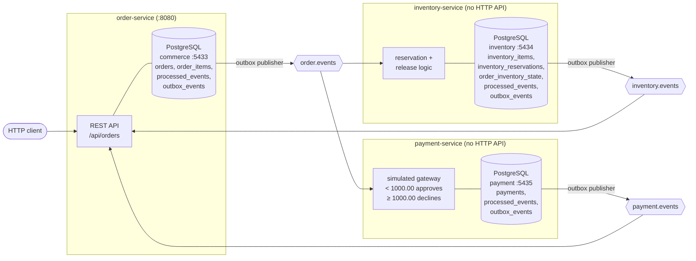

# Architecture

This document describes the system **as it exists in this repository today**.

## Overview

The platform is a set of independently deployable Spring Boot services that
communicate asynchronously over Apache Kafka. There are **three** services,
each owning its own PostgreSQL database. Services never call each other
synchronously and never share a database; the only integration point is Kafka.



Every hop uses the same mechanism: a business transaction writes domain state
**and** an outbox row in one database transaction, and a scheduled,
multi-replica-safe publisher later ships unpublished outbox rows to Kafka. See
[EVENT_FLOW.md](EVENT_FLOW.md) for the message contracts and the outbox
mechanics.

## Runtime components

| Component | Image / module | Local endpoint | Notes |
|---|---|---|---|
| order-service | `services/order-service` | `http://localhost:8080` | Spring MVC REST API + Actuator (`health`, `info`); run on the host |
| inventory-service | `services/inventory-service` | none | No web dependency; Kafka consumer/publisher process; run on the host |
| payment-service | `services/payment-service` | none | No web dependency; runs as a Compose container built from its `Dockerfile` |
| PostgreSQL (orders) | `postgres:17-alpine` | `localhost:${POSTGRES_PORT:-5433}` | Compose service `postgres`; credentials required from `.env`; `pg_isready` healthcheck |
| PostgreSQL (inventory) | `postgres:17-alpine` | `localhost:${INVENTORY_POSTGRES_PORT:-5434}` | Compose service `inventory-postgres`; `pg_isready` healthcheck |
| PostgreSQL (payment) | `postgres:17-alpine` | `localhost:${PAYMENT_POSTGRES_PORT:-5435}` | Compose service `payment-postgres`; `pg_isready` healthcheck |
| Kafka | `apache/kafka:4.0.0` | `localhost:29092` | Compose service `kafka`, single-node KRaft (broker + controller), 3 default partitions, broker-API healthcheck |

All Compose services join one bridge network, use `restart: unless-stopped`,
and (payment-service excepted — it deliberately exposes nothing to probe)
declare healthchecks, so `docker compose up -d --wait` returns only once the
stack is actually ready. See
[DEVELOPMENT.md](DEVELOPMENT.md#2-start-the-infrastructure).

All three services are built on the Spring Boot `4.1.1` parent with
`<java.version>21</java.version>`, use Flyway for schema migrations, and run
with `spring.jpa.hibernate.ddl-auto=validate` — the JPA mappings are validated
against the Flyway-managed schema at startup, never generated from it.

## order-service responsibilities

Source: `services/order-service/src/main/java/com/ahmetkeles/orderservice`

1. **Own the order aggregate.** `Order` and `OrderItem` (`domain/`) enforce the
   invariants: a customer id and a non-blank currency are required, item
   quantity must be positive, unit price must be non-negative, `totalAmount` is
   recomputed from item subtotals, and a new order starts as `PENDING`,
   unsubmitted, with `payment_status = NOT_STARTED`. The aggregate root carries
   a JPA `@Version` column: concurrent writes (`addItem` vs `submit`, a
   reservation vs a cancellation) serialize into exactly one committed
   ordering, never a silent lost update.
2. **Expose the public REST API** (`api/OrderController`):

   | Method | Path | Behavior |
   |---|---|---|
   | `POST` | `/api/orders` | Creates a `PENDING` order from `{customerId, currency}`, returns `201` |
   | `GET` | `/api/orders/{orderId}` | Returns the order with its items, submission flag, and status |
   | `POST` | `/api/orders/{orderId}/items` | Adds `{productId, quantity, unitPrice}`; allowed only while the order is `PENDING` **and not yet submitted** |
   | `POST` | `/api/orders/{orderId}/submit` | Finalizes assembly; requires at least one item; duplicate submits are no-ops |

   `RestExceptionHandler` maps everything to `ApiError {status, error, message}`:

   | HTTP | `error` | When |
   |---|---|---|
   | `404` | `not_found` | Unknown order id |
   | `409` | `order_not_modifiable` | `addItem` on a submitted or terminal order; `submit` on a cancelled order |
   | `409` | `order_empty` | `submit` on an order with no items |
   | `409` | `concurrent_modification` | An optimistic-lock race lost to a concurrent write; the client retries |
   | `400` | `validation_error` / `invalid_argument` | Bean-validation, path-type, or argument failures |

3. **Write outbox events in the same transaction as the state change.**
   `ORDER_CREATED` with the order, `ORDER_ITEM_ADDED` with each item,
   `ORDER_CONFIRMED` with the confirming transition, `ORDER_CANCELLED` with
   each cancellation — each emitted exactly once, in the transaction that
   performed the transition.
4. **Publish the outbox to Kafka** (`order.events`) through the shared
   multi-replica-safe publisher.
5. **Apply inventory and payment outcomes idempotently.** Two consumers with a
   shared `processed_events` ledger (claimed via `ON CONFLICT DO NOTHING`
   inside the mutation's transaction, so a rolled-back mutation releases its
   claim): `InventoryEventsConsumer` marks items reserved
   (`INVENTORY_RESERVED`) or cancels the order
   (`INVENTORY_RESERVATION_FAILED`); `PaymentEventsConsumer` settles the
   payment leg (`PAYMENT_COMPLETED`) or cancels the confirmed order
   (`PAYMENT_FAILED`).
6. **Expose health.** `management.endpoints.web.exposure.include=health,info`.

### order-service schema

Migrations `V1`–`V8`: the order and item tables, the outbox, per-item
`reserved` flags, the `processed_events` ledger, the optimistic-lock
`version`, the `submitted` flag, the `payment_status` column, and a hardening
pass (NOT NULL and CHECK constraints, publisher-shaped partial indexes,
retention indexes).

## inventory-service responsibilities

Source: `services/inventory-service/src/main/java/com/ahmetkeles/inventoryservice`

1. **Own per-product stock.** `InventoryItem` holds `availableQuantity`,
   `reservedQuantity`, and a JPA `@Version` column: two racing reservations for
   the last unit produce exactly one winner.
2. **Reserve per order item, idempotently and transactionally.**
   `OrderEventsConsumer` acts on `ORDER_ITEM_ADDED`. In one transaction the
   service dedups on the envelope's `eventId` (`processed_events`), then either
   moves stock from available to reserved and records the reservation in the
   `inventory_reservations` ledger (keyed by order item id), or catches the
   business failure and records it — both paths commit and emit an outbox row:
   `INVENTORY_RESERVED`, or `INVENTORY_RESERVATION_FAILED` with `reason`
   `INSUFFICIENT_INVENTORY` / `INVENTORY_ITEM_NOT_FOUND`. A reservation
   failure is a modelled outcome, never a consumer error.
3. **Release stock when an order cancels (compensation).** The same consumer
   acts on `ORDER_CANCELLED`: the order is marked cancelled in
   `order_inventory_state` and every still-`RESERVED` ledger row for the order
   is returned to the available pool — all in one transaction, exactly once
   across redeliveries. Reserve and release both lock the order's state row
   first, so a late `ORDER_ITEM_ADDED` arriving after the cancellation
   reserves nothing instead of leaking stock.
4. **Publish the outbox** (`inventory.events`).
5. **No HTTP surface.** There is no API or migration that seeds
   `inventory_items` — stock rows are inserted directly (see
   [DEVELOPMENT.md](DEVELOPMENT.md#seeding-inventory)).

### inventory-service schema

Migrations `V1`–`V4`: stock and `processed_events` tables, the outbox, the
reservation ledger (`inventory_reservations`, `order_inventory_state`), and a
hardening pass (foreign keys, publisher-shaped partial indexes, retention
indexes).

## payment-service responsibilities

Source: `services/payment-service/src/main/java/com/ahmetkeles/paymentservice`

1. **Charge confirmed orders.** `OrderEventsConsumer` acts on
   `ORDER_CONFIRMED` from `order.events` (all other event types on the topic
   are ignored) and charges the order's `totalAmount` through the
   `PaymentGateway` abstraction.
2. **Simulated, deterministic gateway.** `SimulatedPaymentGateway` computes
   the outcome locally — no money moves anywhere:
   - amount **strictly below** `app.payment.gateway.decline-threshold`
     (default `1000.00`) → **approved**;
   - amount **at or above** the threshold → **declined** with a fixed reason.

   The gateway reference is derived deterministically from the idempotency
   key, so a replayed charge yields the identical reference and outcome —
   the behavior a real provider's idempotency keys give. Swapping the bean
   for a real provider is the intended path to production.
3. **Charge at most once, three layers deep.** The `processed_events` ledger
   dedups a redelivered `eventId`; a **unique constraint on
   `payments.order_id`** absorbs a re-emitted confirmation with a fresh
   `eventId`; and the gateway idempotency key **is the order id**, so a crash
   between charge and commit replays into the original outcome. A payment's
   terminal outcome is immutable — no code path updates a `payments` row.
4. **Emit the outcome** through the outbox to `payment.events`:
   `PAYMENT_COMPLETED` or `PAYMENT_FAILED` (a declined charge is a business
   outcome, never a retry and never a dead letter).
5. **No HTTP surface**; runs as a Compose container.

### payment-service schema

Migrations `V1`–`V2`: `payments` (unique `order_id`, amount and status
CHECKs), `processed_events`, the outbox, and retention indexes.

## Order lifecycle

`OrderStatus`: `PENDING`, `CONFIRMED`, `CANCELLED`. Orthogonally,
`payment_status`: `NOT_STARTED`, `PENDING`, `COMPLETED`, `FAILED`.

```
        POST /api/orders
               │
               ▼
          ┌─────────┐   POST …/items   (only while PENDING and unsubmitted)
          │ PENDING │◀──────────────
          │         │   POST …/submit (needs ≥1 item; finalizes assembly)
          └─────────┘
               │
   submitted AND every item reserved          any INVENTORY_RESERVATION_FAILED,
               │                              or PAYMENT_FAILED on a CONFIRMED order
               ▼                                             │
         ┌───────────┐                                       ▼
         │ CONFIRMED │  payment_status → PENDING       ┌───────────┐
         └───────────┘  ORDER_CONFIRMED emitted        │ CANCELLED │
               │                                       └───────────┘
   PAYMENT_COMPLETED → payment_status COMPLETED              ▲
   PAYMENT_FAILED    → payment_status FAILED ────────────────┘
                       (order cancelled, ORDER_CANCELLED emitted,
                        inventory released)
```

The rules, as coded in the aggregate:

- **Explicit submission.** `addItem` is rejected (`409 order_not_modifiable`)
  the moment the order is submitted or terminal, mutating nothing. `submit`
  requires at least one item, is idempotent, and participates in optimistic
  locking.
- **Confirmation has one site.** `PENDING → CONFIRMED` happens iff the order
  is **submitted AND every item is reserved** — whichever half completes last
  performs the transition. A fast reservation cannot confirm an order still
  being assembled; reservations that finish before submission confirm inside
  the submitting transaction itself. The same mutation opens the payment leg
  and emits `ORDER_CONFIRMED`, exactly once.
- **Terminal states latch.** A confirmed order is never cancelled by a late
  reservation failure; a cancelled order is never confirmed by a late
  reservation. The one exception is deliberate: `PAYMENT_FAILED` cancels a
  *confirmed* order through a dedicated payment-failure transition, and the
  first terminal payment outcome wins — `COMPLETED` never becomes `FAILED`,
  and vice versa, across any redelivery.
- **Cancellation always compensates.** Every `PENDING → CANCELLED` and
  payment-failure cancellation emits `ORDER_CANCELLED` in the same
  transaction, and inventory-service releases the order's held stock.

## Cross-cutting patterns

- **Transactional outbox** in all three services, with a
  `FOR UPDATE SKIP LOCKED` claim, bounded lock hold, and a cross-replica
  per-order ordering guard — see
  [EVENT_FLOW.md](EVENT_FLOW.md#transactional-outbox-pattern).
- **Consumer idempotency** in all three services via `processed_events`,
  claimed inside the mutation's transaction.
- **Bounded retries with exponential backoff, then `<topic>.DLT`** in all
  three services — see [EVENT_FLOW.md](EVENT_FLOW.md#failure-behavior).
- **Optimistic locking** on the order aggregate (`orders.version`) and on
  `inventory_items`.
- **Bounded retention** in all three services for published outbox rows and
  expired ledger rows — see [EVENT_FLOW.md](EVENT_FLOW.md#retention).
- **Flyway migrations** with `ddl-auto=validate` everywhere; schemas hardened
  with NOT NULL and CHECK constraints so no write path can persist an
  unrepresentable row.
- **Testcontainers test suites** per service (order 189, inventory 83,
  payment 57) plus a 16-test cross-service end-to-end suite that runs all
  three boot jars as containers against real Kafka and three PostgreSQL
  instances.
- **GitHub Actions CI** running all four suites on Java 21 for every push to
  `main` and every pull request — see
  [DEVELOPMENT.md](DEVELOPMENT.md#continuous-integration).

## Not implemented (by design, for now)

- **notification-service** — no code in this repository.
- Redis or any distributed cache.
- Metrics/tracing beyond Actuator health and info on order-service.
- Load testing, continuous **deployment**, and cloud infrastructure (CI itself
  is implemented).
- A real payment provider — the gateway is explicitly simulated; the
  `PaymentGateway` interface is the seam for a real integration.
