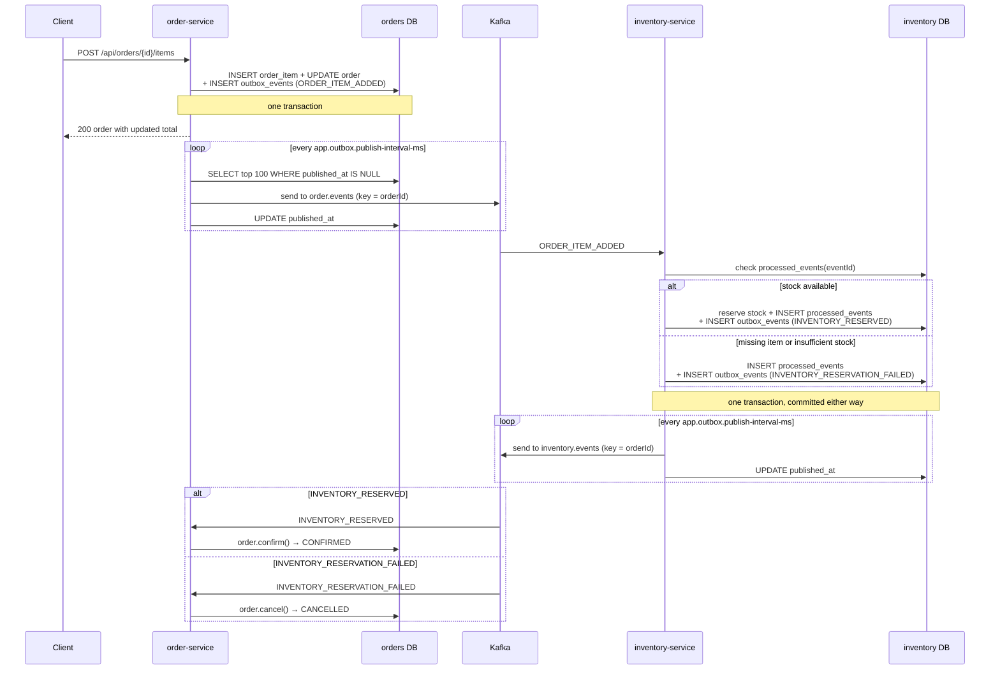

# Event Flow

How the two services actually talk to each other today: the topics, the message
shape, the outbox mechanics, and the failure behavior that exists in code.
For the bigger picture see [ARCHITECTURE.md](ARCHITECTURE.md).

## Kafka topics

| Topic | Produced by | Consumed by | Partitions / replicas | Message key |
|---|---|---|---|---|
| `order.events` | order-service `OutboxPublisher` | inventory-service `OrderEventsConsumer` (group `inventory-service`) | 3 / 1 | order id |
| `inventory.events` | inventory-service `OutboxPublisher` | order-service `InventoryEventsConsumer` (group `order-service`) | 3 / 1 | order id |
| `payment.events` | *(planned payment-service — not in this repository yet)* | order-service `PaymentEventsConsumer` (group `order-service`) | 3 / 1 | order id |

Event types today: `ORDER_CREATED`, `ORDER_ITEM_ADDED`, `ORDER_CONFIRMED`,
and `ORDER_CANCELLED` on `order.events`; `INVENTORY_RESERVED` /
`INVENTORY_RESERVATION_FAILED` on `inventory.events`; and
`PAYMENT_COMPLETED` / `PAYMENT_FAILED` on `payment.events`, which
order-service consumes but nothing in this repository produces yet.
`ORDER_CONFIRMED` (payload: `orderId`, `customerId`, `totalAmount`,
`currency`) is emitted in the same transaction as the `PENDING ->
CONFIRMED` transition, which requires the client to have explicitly
submitted the order AND every item to be reserved (whichever of the two
completes last performs the transition) and also moves the order's
`payment_status` to `PENDING`; `PAYMENT_COMPLETED` settles it to
`COMPLETED`, while `PAYMENT_FAILED` moves it to `FAILED`, cancels the
confirmed order through a dedicated payment-failure transition, and emits
`ORDER_CANCELLED` — feeding the inventory-release compensation. The first
terminal payment outcome wins and is never overwritten.

Topic names come from configuration, not from constants in code:

```properties
# order-service
app.kafka.order-events-topic=order.events
app.kafka.inventory-events-topic=inventory.events

# inventory-service
app.kafka.order-events-topic=order.events
app.kafka.inventory-events-topic=inventory.events
```

Each topic is declared as a `NewTopic` bean by the service that produces it
(`KafkaTopicConfig`), so Spring Kafka's admin client creates it at startup:
order-service declares `order.events`, inventory-service declares
`inventory.events`. Both declarations are conditional — order-service's on
`app.kafka.enabled`, inventory-service's on `app.outbox.publisher-enabled` —
which is how the integration tests keep Kafka out of database-only test runs.

Keys and values are plain strings on both sides
(`StringSerializer` / `StringDeserializer`); the JSON structure below lives
inside the value. Because the key is the order id, all events for one order land
on the same partition and keep their relative order.

## Message envelope

Every message on both topics is the same envelope — the serialized form of
`PublishedOutboxEvent`, built from an outbox row:

```json
{
  "eventId": "0f0d1a2b-3c4d-5e6f-7081-92a3b4c5d6e7",
  "aggregateType": "Order",
  "aggregateId": "9b1c2d3e-4f50-6172-8394-a5b6c7d8e9f0",
  "eventType": "ORDER_ITEM_ADDED",
  "payload": "{\"orderId\":\"9b1c…\",\"productId\":\"…\",\"quantity\":2,\"unitPrice\":9.99,\"totalAmount\":19.98}",
  "occurredAt": "2026-01-01T12:00:00Z"
}
```

Two things about this shape:

- `payload` is a **JSON string**, not a nested object. The producing service
  serialized the domain event into a string before storing it in the outbox
  row, and the consumer deserializes it in a second step
  (`objectMapper.readValue(envelope.payload(), …)`).
- `aggregateType` is `"Order"` on **both** topics. inventory-service writes its
  outbox row against the order aggregate (`aggregateId = orderId`), not against
  the product.
- `eventId` is the outbox row's primary key. It is the de-duplication key used
  by inventory-service.

The timestamp representation follows the Spring-managed `ObjectMapper`
configuration; consumers bind it back into an `Instant`.

## Event types

### `ORDER_CREATED` — `order.events`

Written by `OrderService.createOrder`. Payload:

```json
{ "orderId": "…", "customerId": "…", "currency": "USD", "status": "PENDING" }
```

**No consumer acts on this event today.** inventory-service filters it out.

### `ORDER_ITEM_ADDED` — `order.events`

Written by `OrderService.addItem`. This is the event that drives the whole flow.
Payload:

```json
{ "orderId": "…", "productId": "…", "quantity": 2, "unitPrice": 9.99, "totalAmount": 19.98 }
```

Consumed by inventory-service, which reserves `quantity` of `productId`.

### `INVENTORY_RESERVED` — `inventory.events`

Written by `InventoryReservationService.reserve`. Payload:

```json
{ "orderId": "…", "productId": "…", "quantity": 2 }
```

Consumed by order-service, which confirms the order (`PENDING → CONFIRMED`).

### `INVENTORY_RESERVATION_FAILED` — `inventory.events`

Written by `InventoryReservationService` when a reservation cannot be
satisfied. Payload:

```json
{ "orderId": "…", "productId": "…", "requestedQuantity": 5, "reason": "INSUFFICIENT_INVENTORY" }
```

`reason` is one of:

| Reason | Cause |
|---|---|
| `INSUFFICIENT_INVENTORY` | The product row exists but `availableQuantity < requestedQuantity` |
| `INVENTORY_ITEM_NOT_FOUND` | No `inventory_items` row exists for the product |

Note the field name: the payload carries `requestedQuantity`, not `quantity`.
Consumed by order-service, which cancels the order (`PENDING → CANCELLED`).
Stock is left untouched — a failure never reserves anything.

## End-to-end sequence



## Transactional outbox pattern

Both services use the same implementation, in their own `outbox` package.

**Write side.** The business transaction persists domain state and an
`OutboxEvent` row through the same JPA transaction. If either half fails, both
roll back — `OrderOutboxIntegrationTest.orderCreationRollsBackWhenOutboxWriteFails`
asserts exactly that for order-service. Nothing is ever sent to Kafka from
inside the business transaction, so a committed state change can never be
missing its event and an event can never describe an uncommitted change.

The `outbox_events` table in both services:

| Column | Notes |
|---|---|
| `id` | UUID primary key; travels as the envelope's `eventId` |
| `aggregate_type` | `"Order"` in both services |
| `aggregate_id` | order id; also the Kafka message key |
| `event_type` | `ORDER_CREATED`, `ORDER_ITEM_ADDED`, `INVENTORY_RESERVED`, `INVENTORY_RESERVATION_FAILED` |
| `payload` | `TEXT`, the JSON-serialized domain event |
| `occurred_at` | set at construction |
| `published_at` | `NULL` until the row reaches Kafka |

A partial index on `(occurred_at) WHERE published_at IS NULL` keeps the
publisher's poll cheap as the table grows.

**Publish side.** `OutboxPublisher` is a `@Scheduled` bean
(`fixedDelayString = "${app.outbox.publish-interval-ms:1000}"`, configured to
`1000` ms in both services; `@EnableScheduling` comes from `SchedulingConfig`).
Each run:

1. `findTop100ByPublishedAtIsNullOrderByOccurredAtAsc()` — oldest first, at most
   100 rows.
2. For each row: serialize the envelope, `kafkaTemplate.send(topic, aggregateId,
   message)` and block up to 10 seconds on the result.
3. On success, `markPublished()` and save.
4. On failure, leave `published_at` null so the next cycle retries.
   inventory-service logs the failure; order-service currently swallows it
   silently with only a comment.

Consequences of this design, as built:

- **At-least-once delivery.** A crash between a successful send and the
  `published_at` update re-sends the row on the next cycle. Consumers must
  tolerate duplicates.
- **Retry is unbounded and unbacked-off.** A row that keeps failing is retried
  every cycle forever. There is no dead-letter table, no attempt counter, and no
  alerting.
- **Single-instance assumption.** The poll takes no lock and no
  `FOR UPDATE SKIP LOCKED`, so two instances of the same service would publish
  the same rows twice.
- **Published rows are never pruned.**

`OutboxPublisherTest` / `InventoryOutboxPublisherTest` cover both branches:
a successful publish stamps `published_at`, a failing one leaves it null.

## Idempotency

**inventory-service — implemented.** Every processed envelope's `eventId` is
recorded in `processed_events` inside the reservation transaction — on the
failure path as well as the success path — and `reserve()` returns immediately
if the id is already present. A duplicate `ORDER_ITEM_ADDED` therefore reserves
stock at most once and emits exactly one outbox row, whichever way it resolved.
Asserted by
`InventoryReservationIntegrationTest.duplicateEventDoesNotReserveOrWriteOutboxTwice`,
`InventoryReservationServiceTest.duplicateFailedEventWritesFailureOutboxEventOnlyOnce`,
and, over a real broker,
`KafkaInventoryIntegrationTest.duplicateKafkaEventReservesInventoryOnlyOnce`.

**order-service — not implemented.** There is no `processed_events` equivalent.
Duplicate or interleaved `INVENTORY_RESERVED` / `INVENTORY_RESERVATION_FAILED`
events are harmless only because `Order.confirm()` and `Order.cancel()` are
no-ops on an order that is no longer `PENDING` — the first event to arrive
decides the outcome. Any future consumer logic that is not naturally idempotent
will need real de-duplication.

## Retention (inventory-service)

`RetentionCleanupJob` deletes two kinds of bookkeeping rows on a schedule
(`app.retention.*` in `application.properties`):

- **Published outbox rows** older than `published-outbox-max-age` (default 7d,
  measured from `published_at`). **Unpublished rows are never deleted at any
  age** — the delete predicate requires a non-null `published_at`, so no
  configuration can reach an event the broker has not acknowledged.
- **`processed_events` rows** older than `processed-events-max-age`
  (default 30d).

Every `DELETE` is bounded by `batch-size` (`LIMIT` in the statement) and a run
issues at most `max-batches-per-run` batches per table, each in its own short
transaction; a larger backlog drains across successive runs. Batches claim
their rows with `FOR UPDATE SKIP LOCKED`, so multiple replicas running cleanup
concurrently partition eligible rows instead of contending — and never touch
the publisher's working set, whose locks cover only unpublished rows.

### Replay and idempotency implications

- **The outbox is not the replay log — Kafka is.** Once a row is published,
  replaying the flow means re-consuming the topic, not re-publishing the
  outbox. Deleting published rows therefore costs operational forensics only;
  size `published-outbox-max-age` to the debugging window you want.
- **`processed-events-max-age` bounds the deduplication window.** Deleting a
  `processed_events` row re-opens idempotency for that event id: a duplicate
  delivered afterwards is processed as new. This age **MUST exceed the Kafka
  source topic's retention + the worst-case consumer lag + the operational
  replay / DLT-redrive window** — anyone raising any of those horizons must
  raise it in step. A replay of events older than the window will re-execute
  their effects; for reservations the ledger's per-item key
  (`inventory_reservations.order_item_id`) and the cancelled-order guard still
  stop double stock mutation, but the general guarantee is gone.
- **Dangerous configuration refuses to boot.** The retention bounds are
  bean-validated at startup (`@Validated` on `RetentionProperties`): a zero or
  negative age or batch bound fails binding instead of running — a negative
  max age would place the cutoff in the future and make nearly every
  bookkeeping row deletable in one sweep.

## Failure behavior

| Situation | What happens today |
|---|---|
| Kafka is down while a service is running | Outbox rows accumulate unpublished and are retried each cycle; the API keeps working |
| Broker rejects/times out a send (10 s) | Row stays unpublished; retried next cycle; inventory-service logs, order-service does not |
| Unknown `productId` in `ORDER_ITEM_ADDED` | Caught; transaction commits with a `processed_events` row and an `INVENTORY_RESERVATION_FAILED` event (`reason=INVENTORY_ITEM_NOT_FOUND`); order-service cancels the order |
| Insufficient stock | Caught; transaction commits with a `processed_events` row and an `INVENTORY_RESERVATION_FAILED` event (`reason=INSUFFICIENT_INVENTORY`); stock untouched; order-service cancels the order |
| Malformed message | Consumer wraps the cause in `IllegalStateException` and rethrows (`rejectsMalformedMessage` in both consumer tests) |
| Unknown `orderId` in an inventory event | `OrderNotFoundException` out of `confirmOrder`/`cancelOrder`, wrapped and rethrown by the consumer |
| Event type the consumer does not handle | Silently ignored |
| Order already `CONFIRMED` or `CANCELLED` | The transition is a no-op; the event is consumed and the order is left as it is |

Reservation failures are now a **modelled outcome**, not an error: the consumer
does not throw and the order ends up `CANCELLED`. What is still missing is
recovery from genuine errors — no `DefaultErrorHandler`, retry topic, or
dead-letter topic is configured in either service, so Spring Kafka's
out-of-the-box error handling applies to anything a listener does throw. Retry
policy and DLQs remain **planned, not implemented**.

Stock reserved for an order that later cancels is released: the
`PENDING -> CANCELLED` transition writes an `ORDER_CANCELLED` outbox row
(payload: the order id only) in the same transaction, and inventory-service —
which records every successful reservation in its `inventory_reservations`
ledger, keyed by order item id — marks the order cancelled in its
`order_inventory_state` table and returns each still-`RESERVED` quantity to
the available pool, all in one transaction. Both the reserve and the release
path lock the order's state row first, so a late `ORDER_ITEM_ADDED` arriving
after the cancellation reserves nothing instead of leaking stock.

## Consumer configuration

```properties
# order-service
spring.kafka.consumer.group-id=order-service

# inventory-service
spring.kafka.consumer.group-id=inventory-service
spring.kafka.consumer.auto-offset-reset=earliest
```

inventory-service reads from the beginning of `order.events` on a fresh
consumer group; order-service uses the Spring Kafka default
(`auto-offset-reset=latest`), so events published to `inventory.events` while
order-service has never committed an offset for that group can be skipped.
